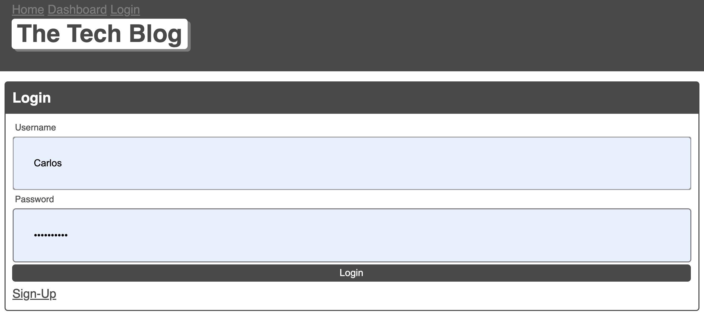
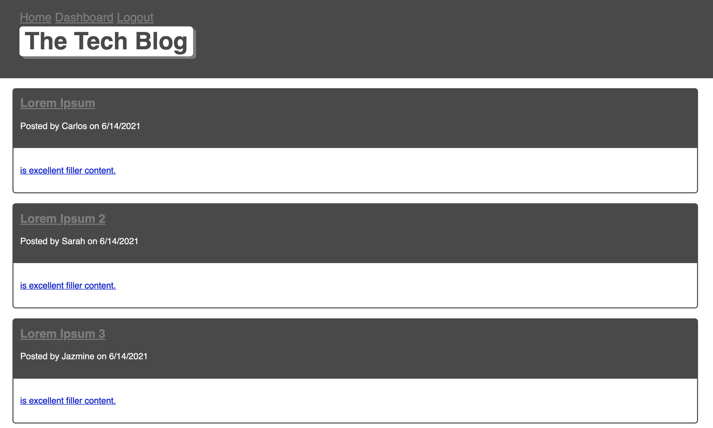
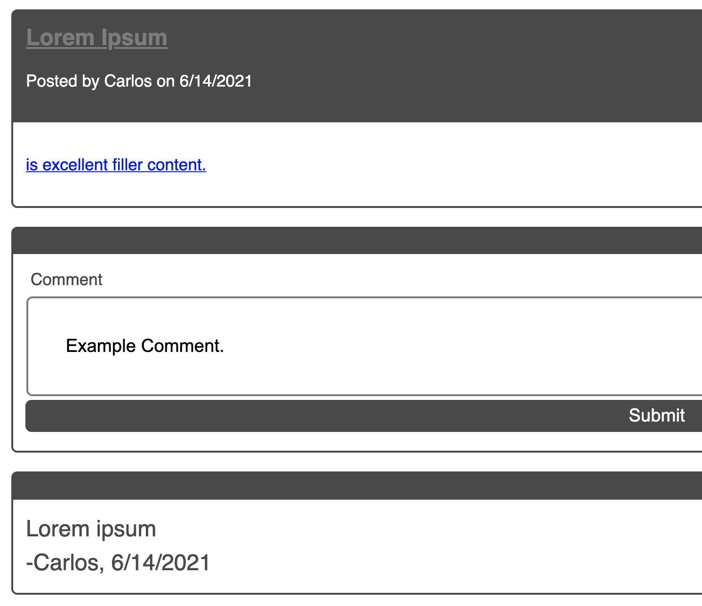

# Tech-Blog

A CMS style where developers can publish and comment on other posts using the MVC paradigm and deployed using Heroku.

[Link to GitHub Repository](https://github.com/WitnessMyHands/Tech-Blog)
[Link to Deployed Application](https://wmh-tech-blog.herokuapp.com/)

## Table Of Contents

- [Description](#Description)
- [Installation](#Installation)
- [Gallery](#Gallery)
- [License](#License)
- [Questions](#Questions)

## Description

This app uses the Model (Data), Controller (Actions), View (Render) model to successfully run the Application. The application uses Handlebars.js as the templating language and Sequelize as the Object-Relational Mapping to handle the information using Javascript. The app uses Express-Session to create User Authentication and is deployed using Heroku.

Project was created using the MVC Paradigm consisting of:
* Sequelize
* Express
* Express Handlebars
* MySQL
* Javascript
* Node.js
* Nodemon
* dotenv
* bcrypt

## Installation

* To use the Application First Install [MySQL](https://dev.mysql.com/downloads/workbench/) and [Node.js](https://nodejs.org/en/)

* Install Your Package using: 
```terminal
npm init --y
``` 

* Install Dependencies using:
```terminal
npm i mysql express express-session express-handlebars sequelize connect-session-sequelize dotenv bcrypt
```

* Install your Database in the WorkBench using the Schema provided in the /db.
and create/use 'tech_blog'.

* Seed your Application with the given data using:
```terminal
npm run seed
```

* Now you are ready to run the Application using:
```terminal
node server.js
```

* Create an envelope file named `.env` inputting your Database Information in the following style:
`DB_NAME`
`DB_USER`
`DB_PASSWORD`

* When the Application has been launched successfully, open the Browser to navigate to your localhost to view the site.

## Gallery

- Sign-up and Login can be accessed from the same page, sign-up required.

- Dashboard Overview showing Posts

- Example Comment and Post Field


## License

[](https://opensource.org/licenses/MIT)

## Questions
*Please contact WitnessMyHands via GitHub with any questions or concerns.*

- https://github.com/WitnessMyHands
